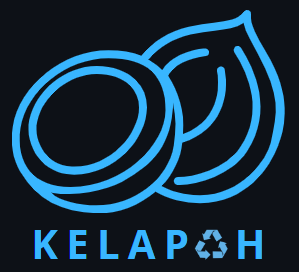

<p align="center"><a href="https://github.com/Rdx11/Kelapah/tree/master" target="_blank"></a></p>

## About Kelapah

Kelapah is an abbreviation for Kelola Sampah. This application is created with the aim of reducing the population of litter in inappropriate places. So, users can utilize the application to report litter, enabling further action to be taken.

## Tech Stack

This project uses the following technologies:

- **PHP**: ^8.1
  The core programming language for backend development.

- **Laravel Framework**: ^10.10
  The main PHP framework powering the application.

- **Composer**: Dependency Manager for PHP
  Used to manage PHP dependencies.

- **Node.js & NPM**:
  JavaScript runtime and package manager for frontend tooling.

- **Laravel Fortify**: ^1.19
  Backend authentication services for Laravel.

- **Laravel Sanctum**: ^3.3
  API authentication for SPAs and mobile applications.

- **Spatie Laravel Permission**: ^6.2
  Role and permission management for Laravel.

- **Unisharp Laravel Filemanager**: ^2.6
  File management for user uploads.

- **GuzzleHTTP**: ^7.2
  HTTP client for making requests.

- **Database**:
  Compatible with MySQL, PostgreSQL, SQLite, SQL Server (MySQL recommended).

- **Web Server**:
  Apache, Nginx, IIS, or Laragon for local development.

- **Development Tools**:
  - **FakerPHP/Faker**: ^1.9.1 (for database seeding)
  - **PHPUnit**: ^10.1 (for testing)
  - **Laravel Pint**: ^1.0 (code style fixer)
  - **Mockery**: ^1.4.4 (mocking in tests)
  - **Nunomaduro Collision**: ^7.0 (error reporting)
  - **Spatie Laravel Ignition**: ^2.0 (error page for Laravel)

---

## Requirements

- PHP 8.1 or higher
- Composer (Dependency Manager for PHP)
- Node.js & NPM
- Database (e.g., MySQL, PostgreSQL, SQLite, SQL Server)
- Web Server (e.g., Apache, Nginx, IIS, or Laragon)

## Local Setup Instructions

Follow these steps to set up Kelapah on your local machine:

### 1. Install Prerequisites

- [Install PHP 8.1+](https://www.php.net/downloads)
- [Install Composer](https://getcomposer.org/download)
- [Install Node.js & NPM](https://nodejs.org/en/download)
- Set up a database (MySQL recommended)
- Set up a web server (or use Laravel's built-in server)

### 2. Clone the Repository

```bash
git clone https://github.com/Rdx11/Kelapah.git
cd Kelapah
```

### 3. Install PHP Dependencies

```bash
composer install
```

### 4. Install JavaScript Dependencies

```bash
npm install
```

### 5. Build Frontend Assets

```bash
npm run dev
```

### 6. Configure Environment Variables

- Copy `.env.example` to `.env` if it does not exist:

    ```bash
    cp .env.example .env
    ```

- Edit the `.env` file and set your database and app configuration:

    - `APP_URL` (e.g., http://localhost/kelapah)
    - `DB_CONNECTION`, `DB_HOST`, `DB_PORT`, `DB_DATABASE`, `DB_USERNAME`, `DB_PASSWORD`
    - Other settings as needed

### 7. Generate Application Key

```bash
php artisan key:generate
```

### 8. Run Database Migrations and Seeders

```bash
php artisan migrate --seed
```

### 9. Create Storage Symlink

This will link the `storage/app/public` directory to `public/storage` so uploaded files are accessible:

```bash
php artisan storage:link
```

### 10. Create Super Admin User

```bash
php artisan make:kelapah-admin --force
```
Follow the prompts to set up the admin credentials.

### 11. Serve the Application

You can use Laravel's built-in server:

```bash
php artisan serve
```
The app will be available at [http://localhost:8000](http://localhost:8000) by default.

Or configure your web server to serve the `public` directory.

---

## Support By

* [PT Amman Mineral Nusa Tenggara](https://www.amman.co.id/id/) - scholarship provider
* [Pintar](https://pintar.co/) - Media Learning

---
